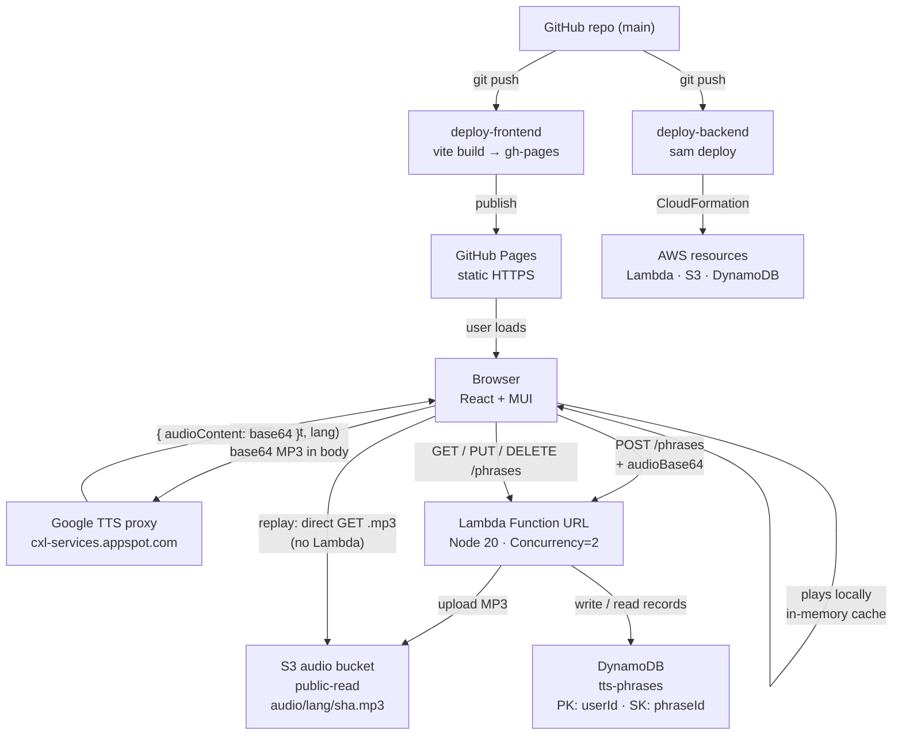

# Language Learning TTS Phrasebook

A personal language learning web app. Type a phrase, hear it spoken at a slow "language teacher" pace via a custom Google TTS endpoint. Save phrases to a library with optional romanization and English translation. Mobile and desktop friendly. Two themes (comic / ink) and four playback modes (Triple / Slow / Normal / Drill).

## Stack

| Layer | Technology |
|---|---|
| Frontend | React + Vite + MUI (Material UI) → deployed to GitHub Pages |
| Backend | AWS Lambda (Node.js 20 + TypeScript) via Lambda Function URL — storage only |
| IaC | AWS SAM (`template.yaml`) |
| Database | DynamoDB (provisioned 1 WCU / 1 RCU — always free) |
| Audio storage | S3 (public-read bucket, audio cached by SHA-256 of text) |
| CI/CD | GitHub Actions |
| TTS | Google TTS v1beta1 via `cxl-services.appspot.com` proxy, Gemini model (`Charon`) — **called directly from the browser** |
| Spec | `openapi.yaml` (OpenAPI 3.1) is the source of truth for the HTTP API |

## Architecture



## Project Structure

```
language-learning-tts-phrasebook/
├── openapi.yaml                ← API contract (OpenAPI 3.1)
├── template.yaml               ← SAM IaC (all AWS resources)
├── samconfig.toml              ← SAM deploy defaults
├── .github/workflows/
│   ├── deploy-backend.yml      ← sam deploy on push to main
│   └── deploy-frontend.yml     ← vite build + gh-pages deploy on push to main
├── frontend/                   ← React + Vite + MUI
│   └── src/
│       ├── main.tsx            ← bootstrap → ThemeController → App
│       ├── App.tsx             ← shell (brand, date, theme toggle, settings)
│       ├── theme/
│       │   ├── comic.ts        ← MUI theme: hard shadows, Bangers display
│       │   ├── ink.ts          ← MUI theme: editorial, Newsreader serif
│       │   ├── augmentation.d.ts ← adds `appName` + `accents` to MUI Theme
│       │   └── ThemeController.tsx ← provider + useThemeController()
│       ├── features/
│       │   ├── compose/        ← Composer, PhraseBubble, LanguagePicker, ModeSelector
│       │   ├── library/        ← Library, PhraseRow, LanguageGroup,
│       │   │                     EditPhraseModal, ConfirmDeleteModal
│       │   └── settings/       ← SettingsModal
│       ├── api/
│       │   ├── client.ts       ← Lambda CRUD (save/list/update/delete + getAudioUrl)
│       │   ├── tts.ts          ← browser TTS proxy call (Pace-aware)
│       │   └── crypto.ts       ← HMAC-TOTP via Web Crypto API
│       ├── domain/languages.ts ← language catalog + needsRomanization()
│       └── playback/player.ts  ← mode sequencer (slow/normal/triple/drill)
└── backend/
    └── src/
        ├── handler.ts          ← Lambda entry + composition root (wires deps)
        ├── domain.ts           ← Phrase entity type
        ├── routes/
        │   └── phrases.ts      ← HTTP parsing, ValidationError, dispatches to use cases
        ├── usecases/
        │   ├── savePhrase.ts   ← decode audioBase64 → S3 upload → DynamoDB write
        │   ├── listPhrases.ts  ← fetch all saved phrases
        │   ├── updatePhrase.ts ← patch transcription / translation
        │   └── deletePhrase.ts ← remove a phrase
        ├── repositories/
        │   └── phraseRepository.ts ← IPhraseRepository interface + DynamoDB impl
        ├── services/
        │   └── audioStore.ts   ← IAudioStore interface + S3 impl
        └── utils/
            └── auth.ts         ← HMAC-TOTP verification (pure function)
```

## Backend Architecture

Clean architecture with explicit layers. Each use case depends only on interfaces, never on concrete AWS classes — making them testable with simple fakes.

| Layer | Responsibility |
|---|---|
| `handler.ts` | Lambda entry, CORS, auth check, HTTP response shaping, composition root |
| `routes/` | Parse raw HTTP headers/body, throw `ValidationError` for bad input, call use cases |
| `usecases/` | Business logic — orchestrates services and repositories via interfaces |
| `repositories/` | Data access — `IPhraseRepository` interface + `DynamoDbPhraseRepository` impl |
| `services/` | External I/O — `IAudioStore` (S3 upload) |
| `utils/` | Pure functions with no dependencies |

The backend does **no TTS calls** — that moved to the browser (see "Key Design Decisions"). Lambda is now a storage-only gateway.

## Frontend Architecture

Organised by feature, not by file type. MUI handles all visual styling via two `createTheme()` objects; component files use MUI primitives + small `sx` overrides where the comic/ink looks differ structurally (speech-bubble tail, rotated tape-label headers, etc.). There is **no global CSS file** — fonts load via `<link>` in `index.html` and the halftone background pattern is a `MuiCssBaseline` override scoped to the comic theme.

| Folder | Purpose |
|---|---|
| `theme/` | Two MUI themes (`comic`, `ink`). `appName` and `accents` are added via module augmentation so components can branch on `useTheme().appName` for structural differences. |
| `features/compose/` | Composing UI — language pills, speech-bubble input, mode selector, save/play. |
| `features/library/` | Phrase list grouped by language; play / edit / delete-confirm modals. |
| `features/settings/` | TTS proxy URL + audio base URL modal. |
| `api/` | Lambda CRUD (`client.ts`), browser TTS call (`tts.ts`), HMAC-TOTP (`crypto.ts`). |
| `playback/player.ts` | Mode sequencer with cancellable `PlayController`. Triple = slow→slow→normal; Drill = looped slow; otherwise single play. In-memory cache by `(lang, pace, text)` so re-pressing Play doesn't re-fetch. |
| `domain/languages.ts` | Static language catalog with display colour swatches; `needsRomanization()` decides whether to show the romanisation field. |

## Key Design Decisions

**Browser-side TTS, Lambda is storage-only:** Earlier versions had Lambda call the TTS proxy. That's now done entirely in the browser — `api/tts.ts` POSTs to the proxy URL from localStorage and gets back base64 MP3. Lambda's `POST /phrases` receives the audio bytes already encoded and just uploads to S3 + writes the DynamoDB row. Lambda never needs the TTS token, so there are no TTS credentials anywhere in the deployment.

**Always save:** Every `POST /phrases` creates a phrase — there is no preview-without-saving mode. Pressing Play in the composer also synthesises via TTS but does not call the backend; it just plays. S3 keys are content-addressed (`audio/{languageCode}/{sha256(normalizedText)}.mp3`), so duplicate text in the same language reuses the same S3 object (the backend handles dedup; a new DynamoDB record is still created).

**No API Gateway:** Lambda Function URL is used directly — it's free. API Gateway charges $3.50/million requests.

**No CloudFront or S3 frontend:** GitHub Pages provides free HTTPS hosting. CloudFront was only needed to add HTTPS to an S3-hosted frontend.

**Public S3 audio bucket:** Audio files are non-sensitive. Public-read avoids generating presigned URLs on every request, simplifying Lambda. The frontend constructs the playback URL directly from `s3Key` — replay does not touch Lambda.

**Default language:** Australian English (`en-AU`).

**TTS endpoint:** `POST https://cxl-services.appspot.com/proxy?url=https://texttospeech.googleapis.com/v1beta1/text:synthesize&token={TOKEN}`. Uses the Gemini-based `Charon` voice (`gemini-3.1-flash-tts-preview`). Pacing is controlled via a natural language `prompt` field in the request body — not SSML. Audio encoding is `MP3`. Response is `{ audioContent: "<base64>" }`. The browser decodes it for local playback and forwards the base64 to Lambda when saving.

**TTS URL at runtime via Settings UI:** The OAuth2 token is short-lived and rotates. The Settings modal has a single input field where you paste the entire proxy URL (including the `?token=...` query param). Stored in `localStorage` and used directly by the browser. No TTS credentials in GitHub Secrets or the deployment pipeline.

**Single DynamoDB table:** `tts-phrases`. Partition key `userId` (always `"default"` — single user, no auth), sort key `phraseId` (UUID).

## Abuse Protection

Two free layers to prevent someone farming TTS credits or hammering the Lambda:

1. **HMAC-TOTP tokens** (`x-app-token` header): `HMAC-SHA256(HMAC_SECRET, floor(Date.now()/30000))` — expires every 30 seconds. Generated by the browser using `crypto.subtle` (no library needed). Stops replay attacks (copied tokens from the network tab expire in ≤60s). Note: the `HMAC_SECRET` is visible in the JS bundle, so a determined attacker who reads the source could generate valid tokens — the concurrency cap is the real backstop.
2. **Reserved concurrency = 2**: Hard cap on simultaneous Lambda executions. 3rd concurrent request gets HTTP 429.

The TTS proxy itself is not protected by us — anyone with the user's pasted token can call it. The token rotates often enough that this is acceptable for personal use.

## API

Single Lambda. Full spec in `openapi.yaml`. Routes:

```
POST   /phrases             — save a phrase (browser supplies audioBase64)
GET    /phrases             — list saved phrases
PUT    /phrases/{phraseId}  — update transcription and/or translation
DELETE /phrases/{phraseId}  — delete a saved phrase
```

All requests require the `x-app-token` header with a valid HMAC-TOTP token.

`POST /phrases` body:
```json
{
  "text": "おはようございます",
  "languageCode": "ja-JP",
  "audioBase64": "<base64-encoded MP3 from the browser TTS call>",
  "transcription": "Ohayou gozaimasu",
  "translation": "Good morning"
}
```

`PUT /phrases/{phraseId}` body (partial — both fields optional):
```json
{
  "transcription": "Ohayou gozaimasu",
  "translation": "Good morning"
}
```

`text`, `languageCode`, and the audio file are immutable — to change them, delete and re-save.

## Secrets

| Secret | Stored in | Purpose |
|---|---|---|
| `HMAC_SECRET` | GitHub Secrets → Lambda env var + Vite build | TOTP token signing |
| `LAMBDA_URL` | GitHub Secrets → Vite build (`VITE_LAMBDA_URL`) | Lambda Function URL (set after first deploy) |
| `AUDIO_BASE_URL` | GitHub Secrets → Vite build (`VITE_AUDIO_BASE_URL`) | S3 audio bucket base URL for direct playback |
| `AWS_ACCESS_KEY_ID` / `AWS_SECRET_ACCESS_KEY` / `AWS_REGION` | GitHub Secrets | Used by `deploy-backend.yml` to run `sam deploy` |
| Full TTS proxy URL (incl. token) | Browser `localStorage` (entered via Settings modal) | Used by the browser to call the TTS proxy directly — **never sent to Lambda** |

## Common Commands

```bash
# Backend
cd backend
npm install
npm run build          # esbuild bundle

# Deploy backend (first time — interactive)
sam deploy --guided

# Deploy backend (subsequent)
sam deploy

# Test Lambda locally
sam local invoke TtsHandler --event events/test-save.json

# Frontend
cd frontend
npm install
npm run dev            # local dev server (http://localhost:5173)
npm run build          # production build → dist/  (runs tsc, then vite build)
```

## Cost

~$0.01/month. Everything within AWS free tiers. Google TTS cost depends on your custom endpoint plan — the browser's in-memory audio cache and S3 replay (zero Lambda invocations for replay) keep TTS calls to one per unique (text, pace) pair.
